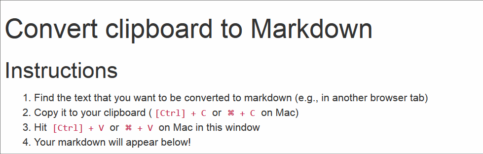

clipboard2markdown
==================

Convert richly formatted text or HTML to
[Markdown](https://daringfireball.net/projects/markdown/).
Paste from the clipboard to a Markdown converter running in
the browser.

Interactive demo
----------------

<http://euangoddard.github.io/clipboard2markdown/>

Video
-----

Usage
-----

Open [index.html](index.html) in a favorite browser and hit `Ctrl+C`
(or `⌘+C` on Mac).

To copy the converted Markdown to the clipboard, press `Ctrl+A`
followed by `Ctrl+C` (or `⌘+A` and `⌘+C` on Mac).

One can paste multiple times. This overwrites the previous conversion.

### Server

Alternatively, the converter may be hosted on a local server:

    $ cd clipboard2markdown
    $ python -m SimpleHTTPServer

Then open <http://localhost:8000/> in the browser.

Tested browsers
---------------

-   Chrome 33 (Linux and OS X)
-   Firefox 27 (Linux)
-   Safari 5 (OS X)
-   Internet Explorer 11

License
-------

Released under the MIT License. See the [LICENSE](LICENSE) file
for details.

Credits
-------

[clipboard2markdown](https://github.com/euangoddard/clipboard2markdown)
was created by [Euan Goddard](https://github.com/euangoddard).

It leverages [html2markdown](https://github.com/kates/html2markdown)
by [Kates Gasis](https://github.com/kates) and
[Himanshu Gilani](https://github.com/hgilani).
The HTML template is based on [Bootstrap](http://getbootstrap.com/).
